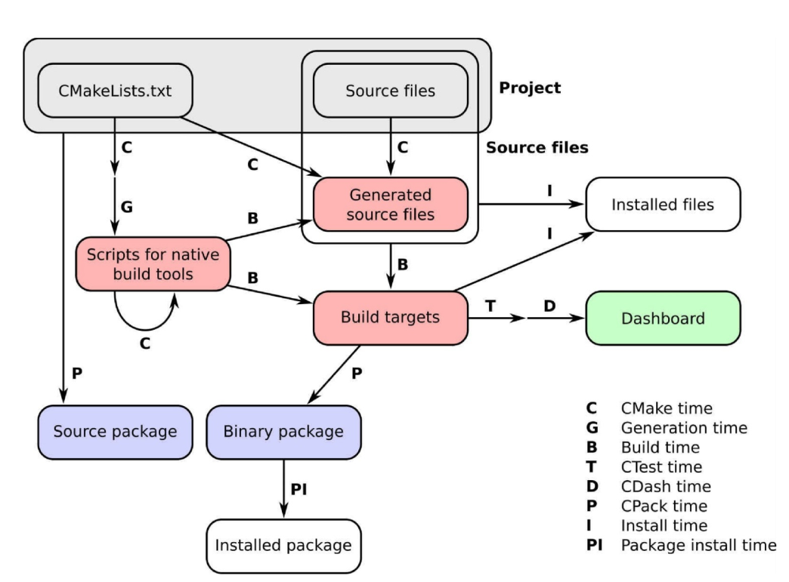

CMake目标很明确：提供一组工具，可以在不同平台上配置、构建、测试和部署项目。

CMake是一个构建生成器，提供了强大的领域特定语言来描述构建系统应该实现的功能。它允许使用相同的CMake脚本集生成平台原生构建系统。CMake工具集，使开发人员可以完全控制给定项目的生命周期：

- CMake是描述如何在所有主要硬件和操作系统上配置、构建和安装项目，无论是构建可执行文件、库，还是两者都要构建。
- CTest定义测试、测试套件，并设置应该如何执行。
- CPack为打包需求提供了DSL
- CDash将项目的测试结果在面板中展示

CMake管理的项目工作时序图如下：

- CMake time或configure time，是CMake运行时的情况，这个阶段，cmake将处理项目中的CMakeLists.txt文件并配置它
- Generation time配置成功后，CMake将生成本地构建工具所需的脚本，以执行项目中的后续步骤
- Build time 是在平台和工具原生构建脚本上调试原生构建工具的时候，这些脚本以前是由CMake生成的。此时，将调用编译器，并在特定的构建目录中构建目标。注意递归的CMake time箭头
- CTest time或test time，运行项目的测试套件，以检查目标是否按预期执行
- CDash time或report time,将测试结果上传到面板，与其他人共享
- Install time,将项目的目标、源文件、可执行文件和库从构建目录安装到安装位置
- CPack time或packaging time，将项目打包以便发布，可以是源代码，也可以是二进制代码。
- Package install time,在系统范围内安装新生成的包

### 本书脉络

- 第一章，从简单的可执行文件到库，如何配置和使用cmake构建简单的可执行文件和库
- 第二章，检测环境，如何使用简单的cmake命令与操作系统和处理器体系结构交互
- 第三章，检测外部库和程序，如何简化对项目依赖项的检测
- 第四章，创建和运行测试，解释如何利用CMake和CTest的功能来定义和运行测试
- 第五章，配置时操作和构建时操作，如何使用CMake在构建过程的不同阶段执行定制化操作
- 第六章，生成源码，CMake命令可自动生成源码
- 第七章，结构化项目，用于组织您的项目，使它们更易于维护
- 第八章，超级构建，解释了CMake超级构建模式，用于管理关键项目的依赖关系
- 第九章，混合语言项目，构建不同编程语言混合的项目
- 第十章，编写一个安装程序，使用CMake安装项目
- 第十一章，打包项目，如何使用CPack生成源文件，并将源文件打包，以及构建用于发布的python和conda包
- 第十二章，生成文档， 如何使用CMake也生成代码的文档
- 第十三章，选择生成器和交叉编译， 如何使用CMake交叉编译项目
- 第十四章，测试面板， 如何将测试结果报告到在面板上
- 第十五章，将项目移植到CMake中， 将展示实践示例、 注意事项和一些技巧， 这些将帮助您将项目移植到基于CMake的构建系统中

### 参考文献
- [https://cmake.org/documentation/](https://cmake.org/documentation/)
- [https://github.com/onqtam/awesome-cmake](https://github.com/onqtam/awesome-cmake)
- [Craig Scott的《Professional CMake》](https://crascit.com/professionalcmake/)

